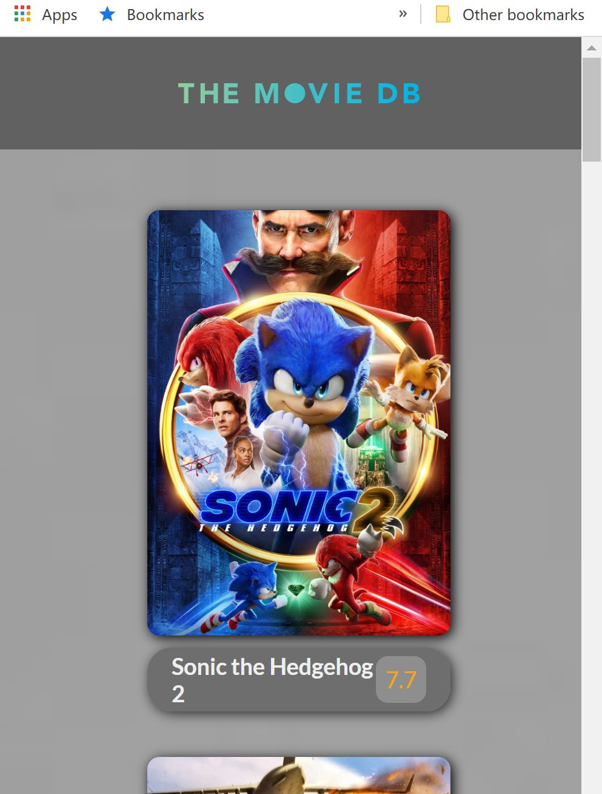

# Moive App

A movie web-app allowing users to see the latest movie info and watch trailers [Live Link](https://jeffdeng-movieapp.netlify.app/)

## Description

The is a Vanilla JS app.

The purpose of this project is to practice and enhance my front-end development skills, especially the fundamental HTML, CSS and JavaScript.

## Relevant Techs

### Front-End:

- JavaScript
- HTML5
- CSS3

## Key Features

- Search
  
- Pagination
  
- Trailer preview with integrated iframe tag
  
- Fully mobile responsive with flex box
  

## Challenges

- To achieve the trailer preview was a bit difficult, I applied iframe uri for each movie while looping through elements

- It is always headache to operate DOM and BOM using pure JS, that's why we like to use framework such as React!
